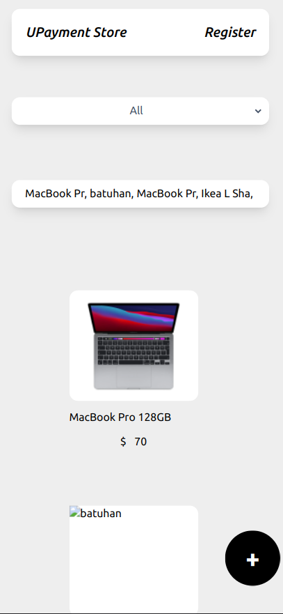

#  UPayment Online Store

A case study project for **UPayments**

## Demo

[See Demo](https://batuhan-baybas-upayment-case-study.netlify.app/) 

## Screenshots





### Run Loacaly

Clone the project

```bash
 git clone https://github.com/batuhanbaybas/batuhanbaybas-reactjs.git
```

Go to the project directory

```bash
  cd upayment-case
```

Install dependencies

```bash
  npm install && yarn install
```

Start the dev server

```bash
  npm run start && yarn start
```

## Tech Stack

- [Redux-toolkit/react-redux](https://redux.js.org/) - A library for managing state in your React apps.
- [Formik && Yup](https://formik.org/) - A library for validating and handling forms in React.
- [React-router-Dom](https://reactrouter.com/) - A routing library for React
- [Tailwindcss](https://tailwindcss.com/) - A utility-first CSS framework
- [Axios](https://axios-http.com/) - A Promise based HTTP client for the browser and Node.js
- [React-Lottie](https://github.com/chenqingspring/react-lottie) - Make beautiful, animated loading section adapt to your app.

